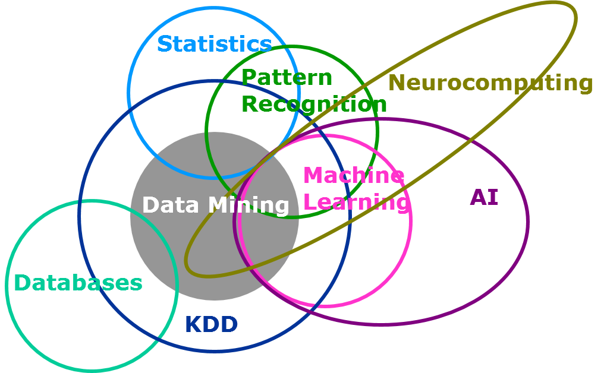

---

  

 
 
--

---

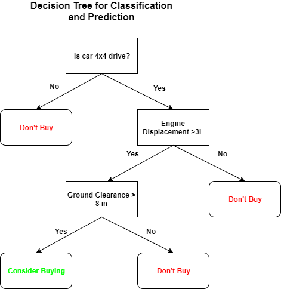

---
#  Problem formulation 

.pull-left[+ Data set
	+ **X** [N, M]: N samples, N features
	+ **y** : N labels (outcomes / responses)
+ Machine Learning:
	+ Type of task
	+ Batch vs online
	+ Supervision
]
.pull-right[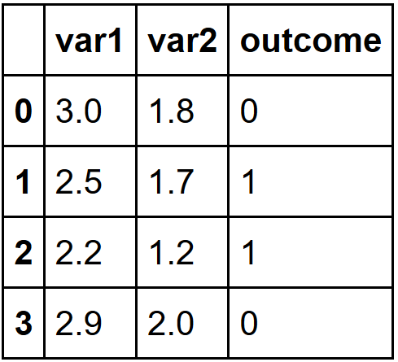]

---
#  By task: 

+ In **classification** the algorithm must assign inputs to one of two (or more) classes
+ In **regression** the algorithm returns a value for each sets of inputs received
+ In **clustering** the algorithm divides the inputs supplied into two or more subgroups
+ In **density estimation** the algorithm constructs an estimate for the population distribution based on a small subset of the whole
+ Finally, **dimensionality reduction** maps inputs on to a lower dimensional space

---
#  Batch vs Online 

+ In **batch learning** algorithms all the data is available and can be processed at one time
+ In **online learning** algorithms only part of the data is available for inclusion at any one time

---
#  Supervised vs Unsupervised 

+ In **supervised learning** each of the supplied inputs is labeled with the desired output
+ In **unsupervised learning** no labels are available and the algorithm must find the underlying structure in the data itself
+ Somewhere in the middle is **semi-supervised learning** in which only some of the supplied inputs also have the desired output
+ In **reinforcement learning** the algorithm must interact with an environment to perform certain actions that maximize reward

---

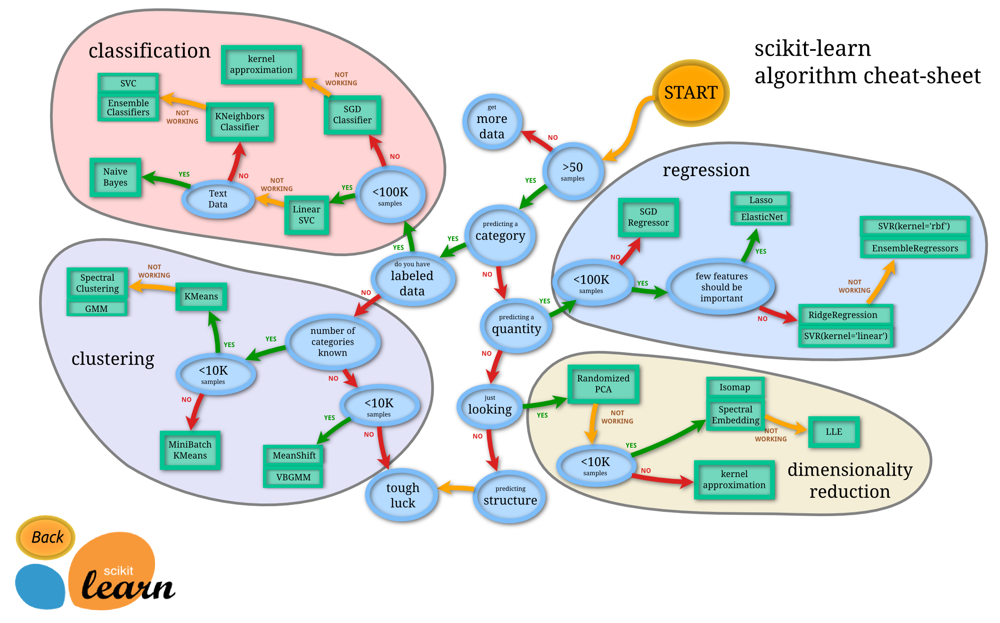

---
#  Classification 

.pull-left[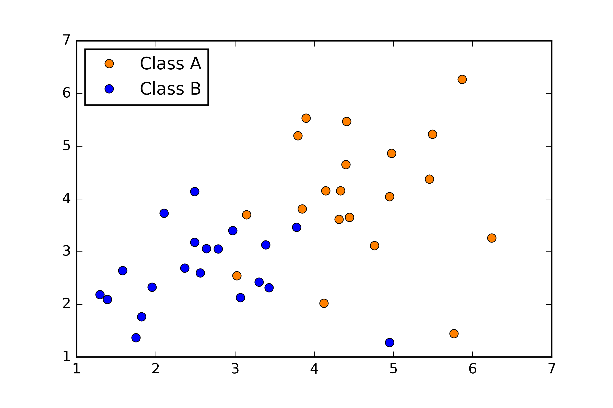]

.pull-right[]

---
#  Classification 

.pull-left[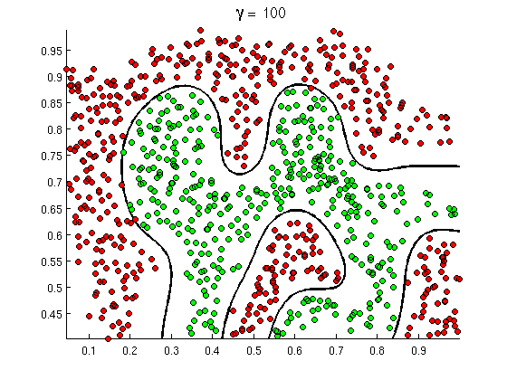]

.pull-right[]

---
#  Regression 

+ Predicted variable
+ Observed variable
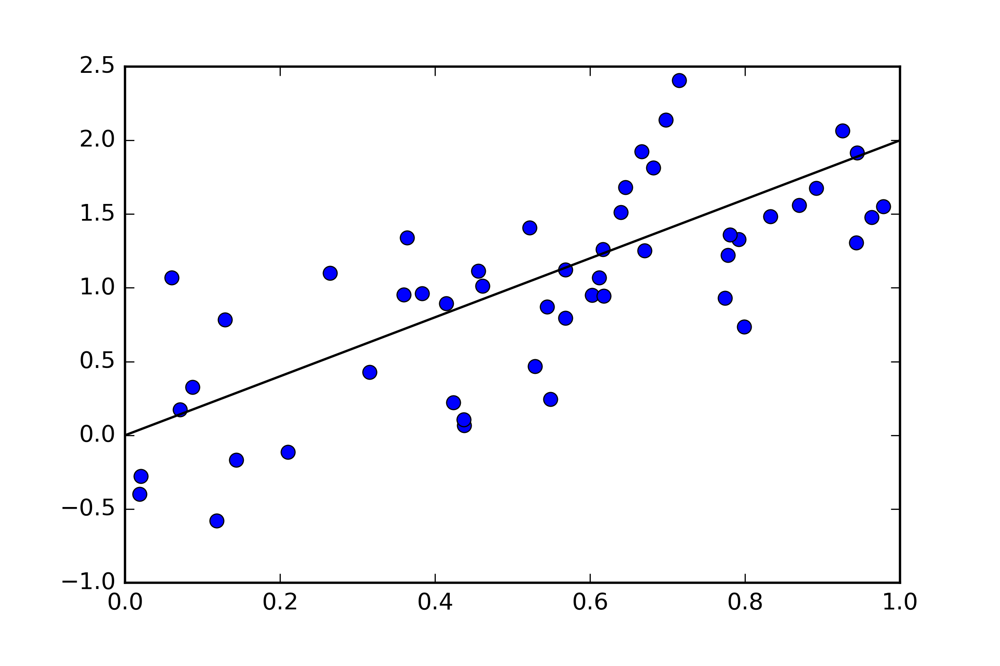

---
#  Clustering 

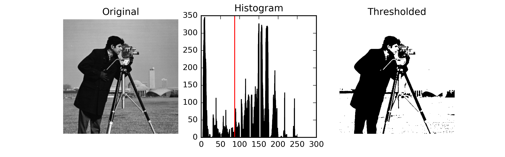

---
#  Clustering 

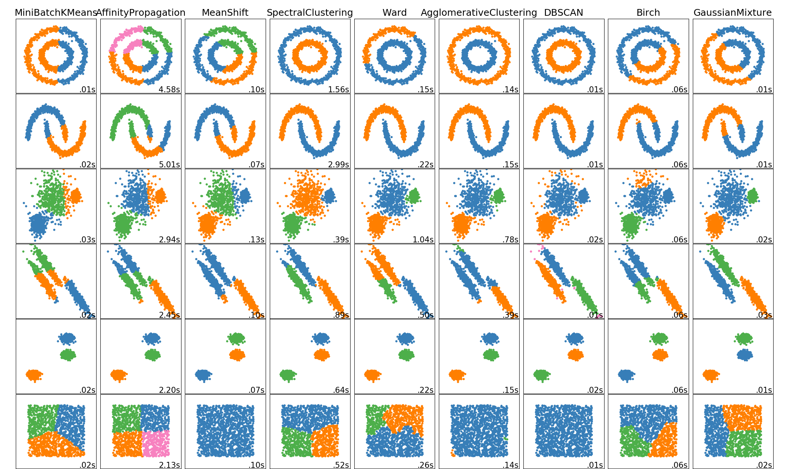

---
#  Latent variable models, density estimation 

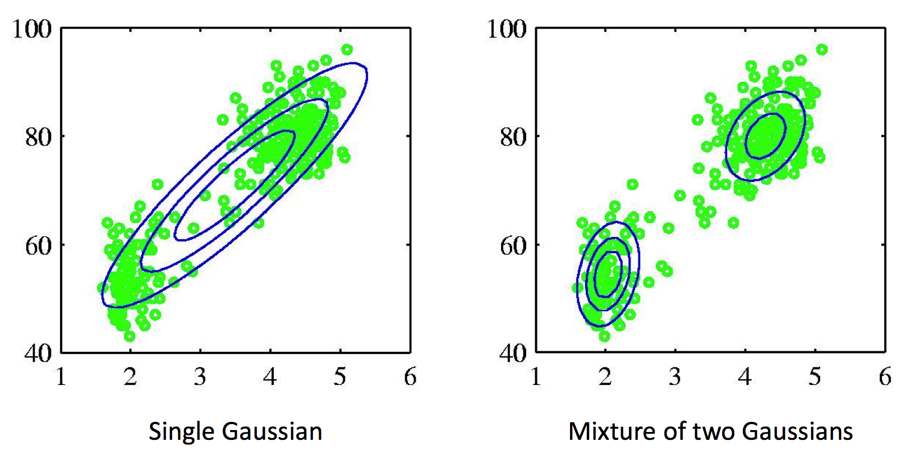

---
#  Dimensionality reduction, feature selection 

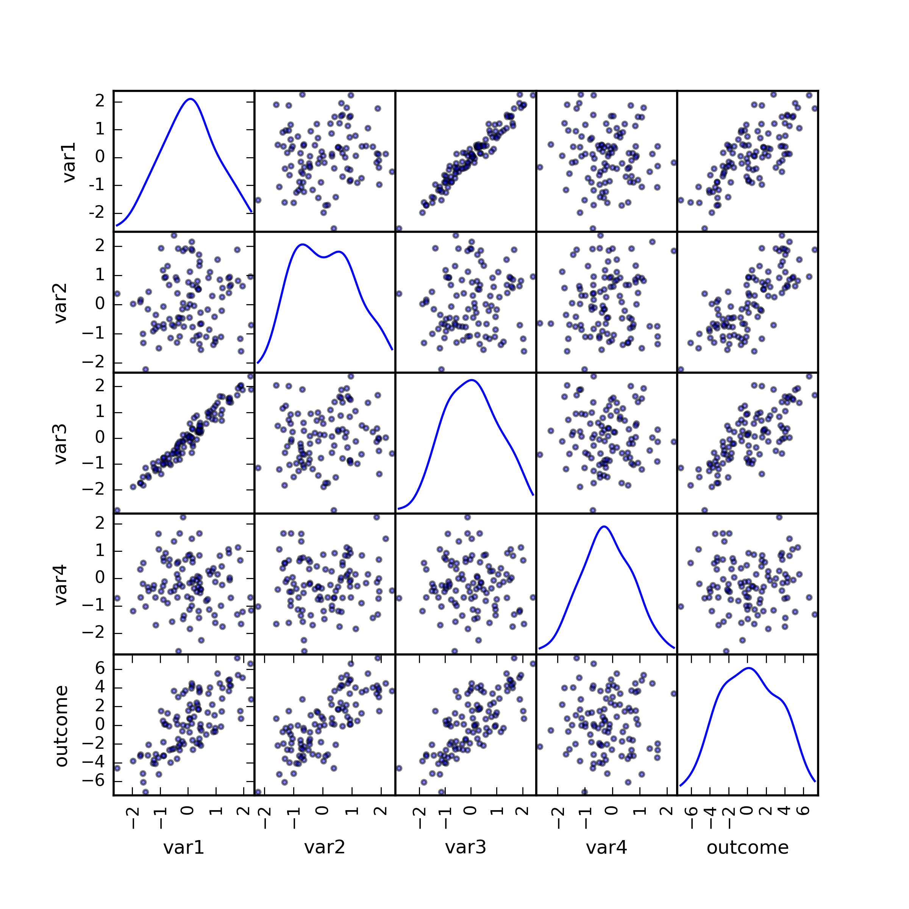</img>

---
#  Dimensionality reduction for visualization 

.pull-left[]

.pull-right[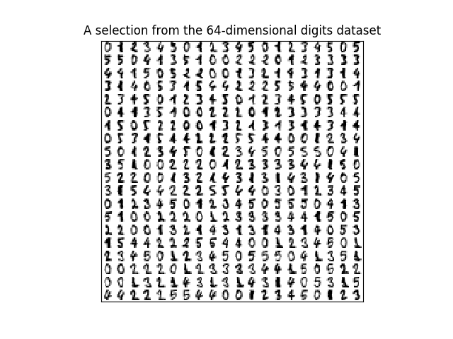]

---
#  Simple neural networks and Deep Learning 

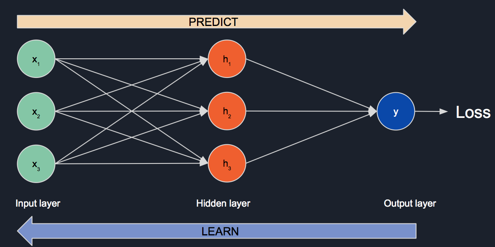

---
#  When to use Machine Learning? 

+ **You cannot code the rules:** Many tasks cannot be adequately solved using a deterministic rule-based solution. A large number of factors could influence the answer (feature space is large)
+ **You cannot scale:** ML solutions are effective at handling large-scale problems (sample space is large)
+ Machine learning benefits come at a price (computational, design)
