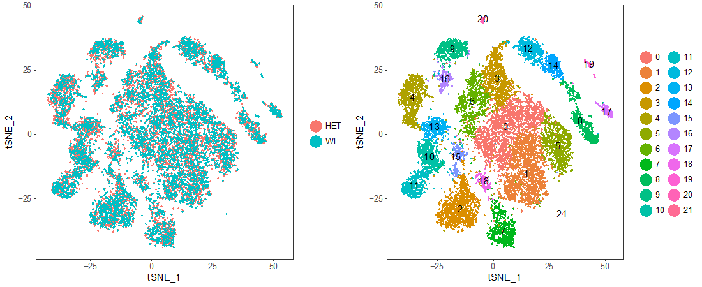
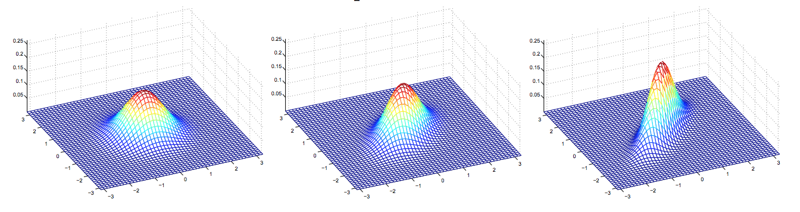

#  Unsupervised Learning 

+ Unlabeled dataset
+ Attempts to find underlying patterns in the data
+ Examples:
	+ Clustering
	+ Anomaly detection
	+ Others



---
#  Outline 

+ Gaussian mixture models
+ Expectation-maximization
+ Factor analysis


---
#  K-means 

+ K-means works well when data is “spherical”
+ E.g. dataset on right shows 3 spherical clusters
+ K-means with k=3 reliably identifies the clusters


---
#  K-means 

+ Data often not as neat as previous example
+ K-means creates suboptimal clusters
+ We need alternative clustering approaches


---
#  Mixture models 

+ 2 types of clustering:
	+ Hard clustering: clusters do not overlap (e.g. K-means)
	+ Soft clustering: clusters may overlap
+ Mixture models provide *probabilistic* interpretations of cluster assignment
+ Need to *learn* mean and variances from dataset


---
#  Gaussian (normal) distributions 


.pull-left[
+ Notation: $X\sim {\mathcal {N}}(\mu ,\sigma ^{2})$
+ PDF: $\frac {1}{\sqrt {2\pi \sigma ^2}} e^{-\frac {(x-\mu )^2}{2\sigma^2}}$
+ ***Central limit theorem*** *: sample mean of* *r.v.s* *will approach Normal as the sample size grows, regardless of the initial distribution*
]
.pull-right[

]


---
#  1D example (labeled training set) 

+ Let’s take a simple supervised example, in which we have 10 labeled data points


---
#  Gaussian mixture models 

+ What if we don’t know the labels?
+ We want to predict which distribution each point came from
+ The cluster is thus **latent** (hidden)


---
#  Expectation Maximization (EM) 

+ A way for us to assign the points to k=2 Gaussians

**EM Algorithm:**
+ Start with k=2 randomly placed Gaussians $(\mu_1,\sigma_1), (\mu_2,\sigma_2)$
+ Repeat until convergence:
	+ *E-step:* For each data point $x_i$, calculate $P( k_j|x_i )$ 
	  + i.e. how likely  that $x_i$ came from cluster $k_j$
	+ *M-step:* Adjust $\mu_1$, $\sigma_1$, $\mu_2$, $\sigma_2$ to fit points assigned to them


---
#  E-step 

+   How typical is given the Gaussian ?
+   How likely that came from cluster
+ Use these posterior probabilities as weights for points .


---
#  M-step 

+ Update the means and the covariance of the Gaussians using the weighted points


---
#  Multivariate Gaussians 
+ Generalization of univariate Gaussian to higher dimensions
+ Notation: $\mathcal{N}(\boldsymbol\mu,\,\boldsymbol\Sigma)$, where ∑ is the *covariance matrix*
+ PDF: $(2\pi )^{-{\frac {k}{2}}}\operatorname {det} ({\boldsymbol {\Sigma }})^{-{\frac {1}{2}}}\,e^{-{\frac {1}{2}}(\mathbf {x} -{\boldsymbol {\mu }})'{\boldsymbol {\Sigma }}^{-1}(\mathbf {x} -{\boldsymbol {\mu }})}$




---
#  How to pick K? 

+ How do we choose the number of Gaussians?
+ Occam’s razor: pick “simplest” of all models that fit the data
	+ Bayes information criterion (BIC)
	+ Akaike information criterion (AIC)


---
#  GMM advantages & disadvantages 

+ Advantages:
	+ Probabilistic method
	+ Soft clustering: data point can come from multiple clusters
+ Disadvantages: similar to k-means
	+ Sensitive to starting point (should try multiple random initializations)
	+ Converges to a local maximum


---
#  n >> m 

+ GMMs work well when the number of training examples (m) is significantly larger than the dimension (n) of the data
+ Much more difficult to model data when n >> m
+ How do we deal with this situation?


---
#  Biological example 

.pull-left[
+ Microarray / RNA-seq data
	+ 20,000 genes (n)
	+ Couple hundred samples (m)
]

.pull-right[

]

---
#  Factor analysis 

+ A method for reducing dimensionality
+ Assumption: variations in observed variables reflect variations in *fewer*  latent variables

---
#  FA: the model 

+ Observed data:
+ Latent variable model for x:
	+ is the ”factor loading” (i.e. the weight)
	+ is the factor
	+ is a noise term
+ Simplified version: 3 latent variables
+ ** You do not need to know these equations; they are just here for reference*


---
#  Performing FA 

+ We provide the number of factors (more on this in week 10)
+ Then the model needs to learn the parameters: and 
+ Use EM!

---
#  FA example output 

+ 300 students responded ranked their favorite subjects on a scale of 1-5
+ Subjects included: biology (BIO), geology (GEO), chemistry (CHEM), algebra (ALG), calculus (CALC), and statistics (STAT).
+ Ran FA with 2 factors

```{r tbl28, echo = FALSE}
tbl28 <- tibble::tribble(
~` `, ~`FACTOR 1`, ~`FACTOR 2`,
"BIO",".85",".13",
"GEO",".78",".13",
"CHEM",".86",".06",
"ALG",".03",".79",
"CALC",".10",".97",
"STAT",".17",".51"
)

kableExtra::kable_styling(knitr::kable(tbl28), font_size = 18)
```

---

.pull-left[
+ Can subjectively rename factors, e.g.:
	+ Factor 1 = “Math”
	+ Factor 2 = “Science”
]
	
.pull-right[

]

---
#  Summary 

+ Factor analysis is a way to reduce dimensionality of your data
+ Assumes that variance in the dataset originates from fewer latent variables
+ There are other approaches that you will learn in another lecture
+ You will also learn how to more objectively choose the number of factors


---
#  Note about the homework 

+ Part 1: Gaussian mixture models
	+ You will implement a GMM on the Old Faithful dataset
+ Part 2: Factor analysis
	+ You will perform FA on survey responses to beer preferences
+ Plots will be manually graded, not through assertions
